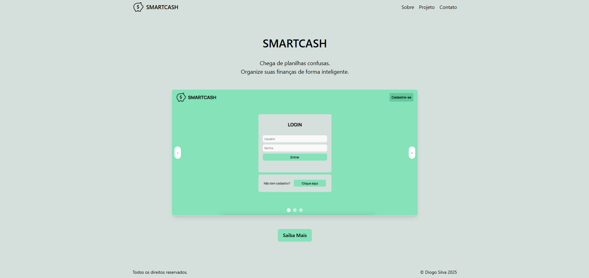
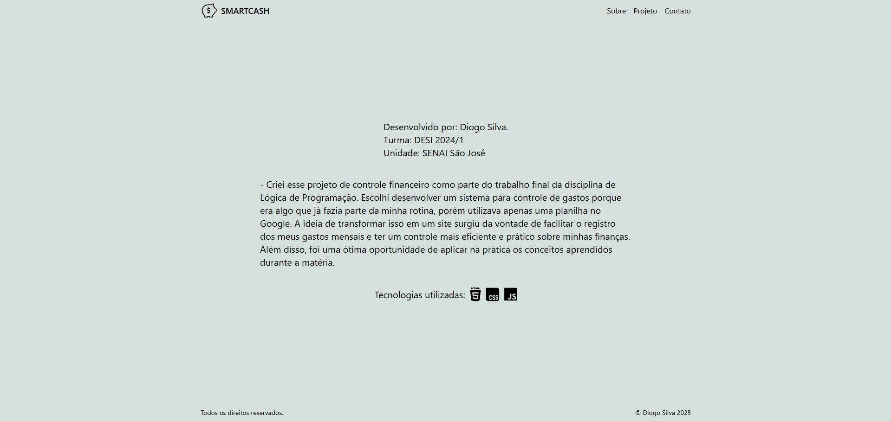
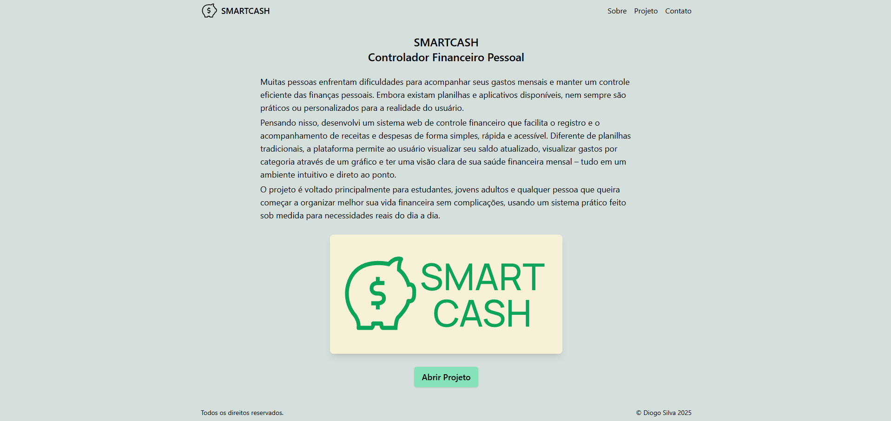
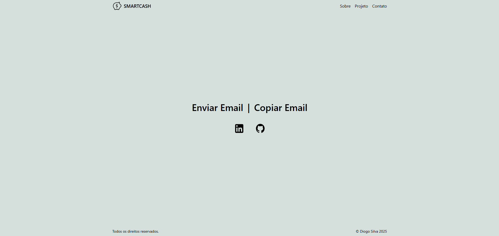

# Landing Page com React Router

Este projeto é uma **landing page** desenvolvida com **React** e **React Router**, criada com o objetivo de praticar a navegação entre páginas em aplicações React. A página apresenta um projeto anterior que foi implementado utilizando HTML, CSS e JavaScript puros.

## 🚀 Tecnologias Utilizadas

- [React](https://reactjs.org/)
- [React Router DOM](https://reactrouter.com/)
- [Tailwind CSS](https://tailwindcss.com/docs/installation/using-vite)

## 🎯 Objetivo do Projeto

- Praticar a configuração e utilização do `react-router-dom` para navegação entre páginas.
- Estruturar componentes reutilizáveis para cada seção da landing page.
- Reaproveitar o conteúdo de um projeto anterior, aplicando conceitos modernos de desenvolvimento com React.

## 🖼️ Layout do Projeto

### 🏠 Página Inicial


### 👤 Sobre


### 📁 Projetos


### 📞 Contato


> As imagens acima ilustram cada seção da landing page, demonstrando a navegação entre elas utilizando o React Router.

## 🔧 Como Executar o Projeto Localmente

Siga os passos abaixo para clonar e executar o projeto em sua máquina:

```bash
# Clone o repositório
git clone https://github.com/di0gosilva/landingpage.git

# Acesse o diretório do projeto
cd landingpage

# Instale as dependências
npm install

# Inicie o servidor de desenvolvimento
npm run dev
